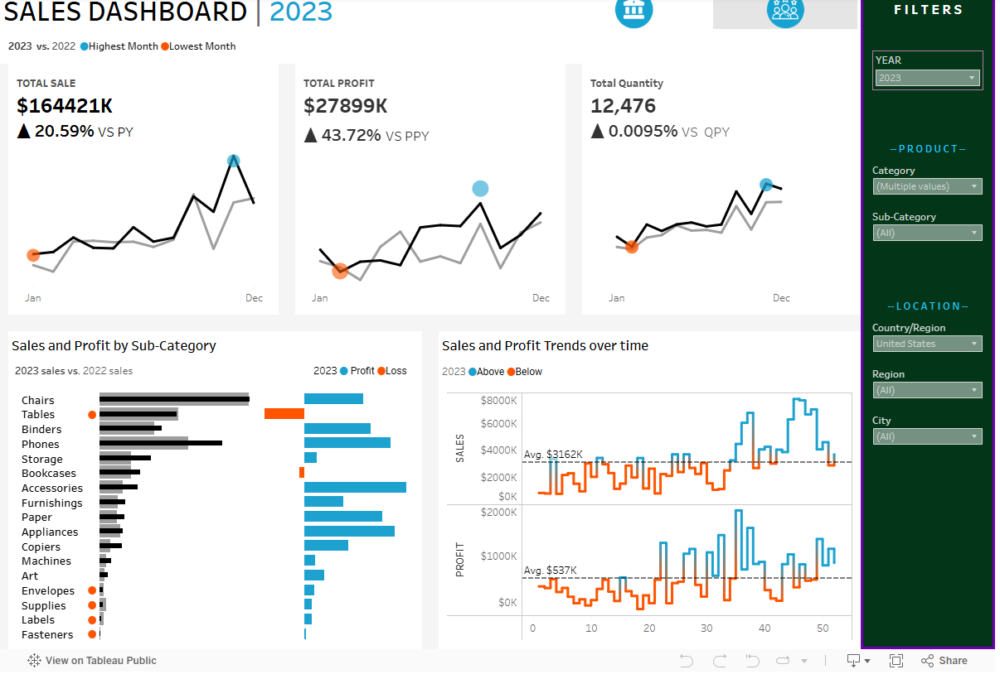

# 📊 Sales & Profit Dashboard 2023

## 📌 Overview
This project presents a **Sales and Profit Dashboard** for the year **2023**, built in Tableau, providing insights into:
- Total sales, profit, and quantity trends.
- Sub-category performance comparison between 2023 and 2022.
- Weekly sales and profit patterns.
- Geographic breakdown with filter options.

The dashboard is interactive, allowing filtering by year, category, sub-category, country, region, and city.

---

## 📊 Dataset
- **Source:** Superstore Sample Dataset (Tableau default dataset) *(or replace with actual source)*  
- **Data Points:**
  - Order Date
  - Category & Sub-Category
  - Sales
  - Profit
  - Quantity
  - Location (Country, Region, City)

---

## 🛠 Tools & Technologies
- **Data Visualization:** Tableau Public
- **Data Source:** Excel/CSV (Superstore Dataset)
- **Version Control:** GitHub

---

## 📈 Key Insights
1. **Total Sales:** $164,421K — **+20.59%** vs Previous Year.  
2. **Total Profit:** $27,899K — **+43.72%** vs Previous Year.  
3. **Top Profitable Sub-Categories:** Binders, Phones, Accessories.  
4. **Loss-Making Sub-Categories:** Tables, Bookcases.  
5. **Quantity Sold:** 12,476 units — stable compared to the previous year.

---

## 📷 Dashboard Preview
  

---

## 🔗 Live Dashboard
[View on Tableau Public]([your-tableau-link-here](https://public.tableau.com/app/profile/paras.saini7560/viz/Book1_17491906075340/SALESDASHBOARD))

---

## 📂 Repository Structure
